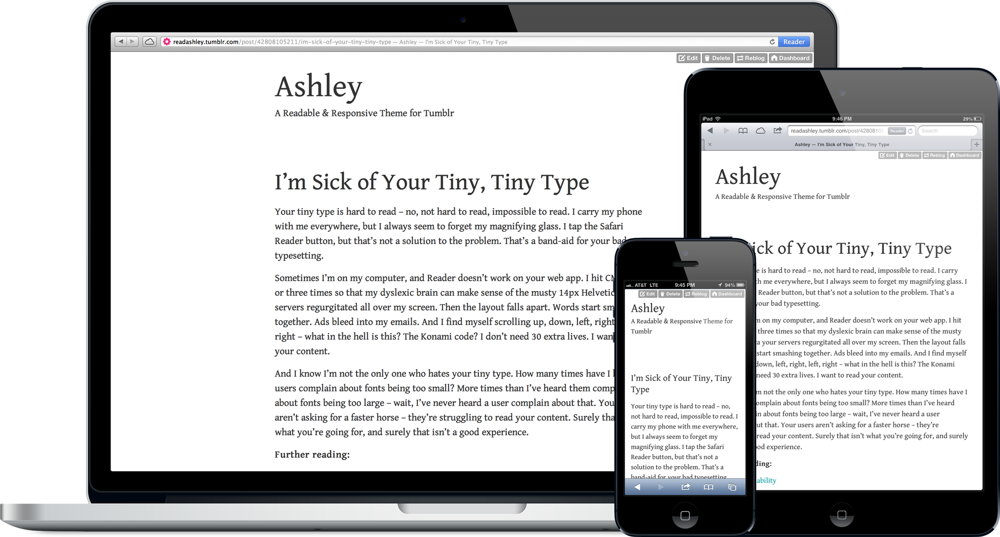

Ashley
======

A Responsive and Readable Theme for Tumblr, utilizing Google Web Fonts



## Readable
Don't hunch over. Sit back and enjoy.

## Responsive
Content is device agnostic. Your blog should be too.

## Minimal
Just what you need. No more. No less.

## Customizable
Use any Google Web Font. Defaults to Gentium Book.

[jxnblk.com/ashley](http://jxnblk.com/ashley)

[View on Tumblr Themes](http://www.tumblr.com/theme/37012)

---

## How to switch Google Web Fonts in Tumblr

1. Choose a font from [Google Web Fonts](http://www.google.com/webfonts)

2. Go to your blog and click Customize

3. In the *GoogleWebFont* field, type or paste in the name of the font – e.g. *Gentium Book Basic*

4. In the *GoogleWebFontURL* field, type or paste in the name as it appears in Google's code – e.g. *Gentium+Book+Basic*

5. Click *Save*

---

## How to use Typekit

1. Create a kit on Typekit

2. Go to your blog and click *Customize*

3. Click the *Edit HTML* button

4. Replace the Google Web Font block with the Typekit embed code

    ```html
    <!-- Replace this block: -->
    {block:IfGoogleWebFont}
      <link href='http://fonts.googleapis.com/css?family={text:GoogleWebFontURL}' rel='stylesheet' type='text/css'>
    {/block:IfGoogleWebFont}

    <!-- with your Typekit embed code: -->
    <script type="text/javascript" src="//use.typekit.net/XXXXXXX.js"></script>
    <script type="text/javascript">try{Typekit.load();}catch(e){}</script>
    ```

5. Replace the font-family declaration with the one from Typekit

    ```html
    <!-- Change this line: -->
    font-family: '{text:GoogleWebFont}', Georgia, serif;

    <!-- To something like this: -->
    font-family: "skolar",serif;
    ```

6. Click *Update Preview*, then *Save*


